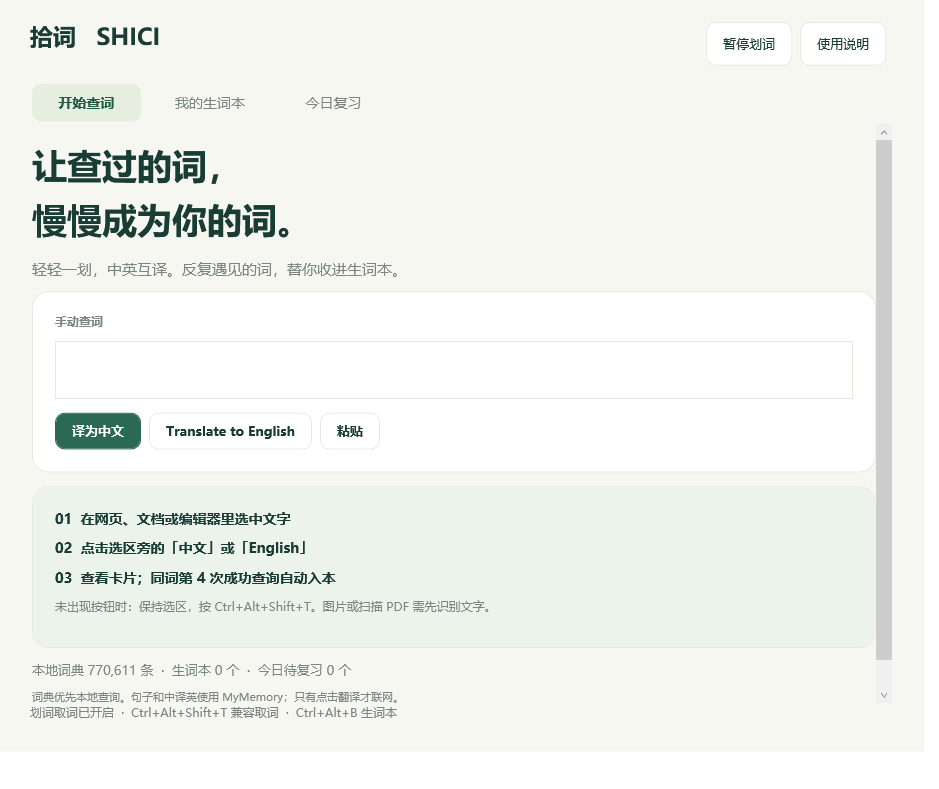
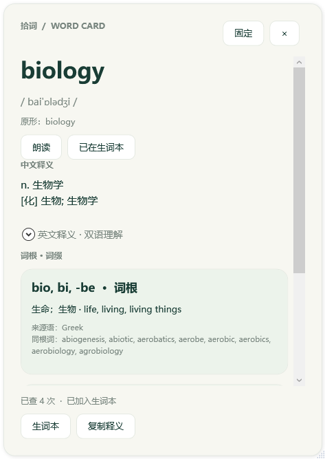
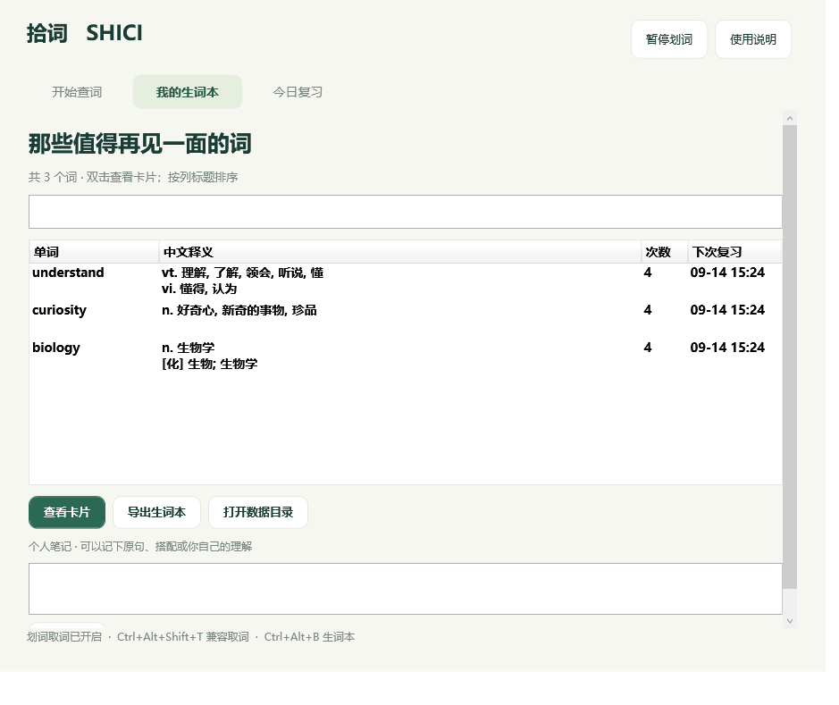
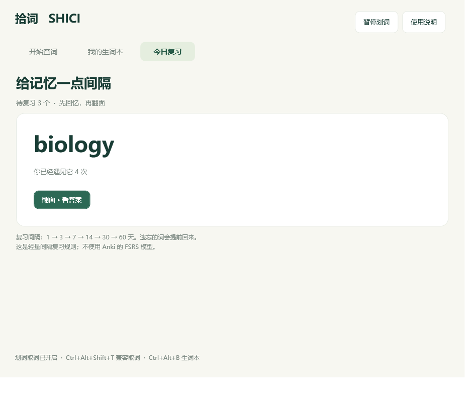

# 拾词 Shici

**一个轻量的 Windows 划词翻译与生词本工具。让反复查过的词，慢慢成为你的词。**

[下载 Windows 版](https://github.com/walterkken/shici/releases/latest) · [使用说明](docs/usage.md) · [反馈问题](https://github.com/walterkken/shici/issues/new/choose) · [提出建议](https://github.com/walterkken/shici/issues/new?template=feature_request.yml)



## 能做什么

- **划词翻译**：拖选文字或双击单词，选区附近显示「中文 / English」两个按钮。
- **中英互译**：英文词典查询优先在本地完成，中文翻英文和词典外文本使用免配置联网翻译。
- **单词卡片**：查看中文释义、英文释义、音标、原形、词形变化，以及有资料支持的词根词缀。
- **自动收词**：同一个词在第 **4 次成功查询**时自动加入生词本。只选中、翻卡复习或查询失败不计数。
- **词形合并**：例如 `run`、`running`、`RUN` 尽量归到同一词条；有歧义时显示提示。
- **间隔复习**：先回忆、再翻面，按「记住了 / 还没记住」安排下一次复习。
- **个人整理**：可写原句、搭配和笔记，导出 Markdown、TSV 及 Anki 可导入文件。
- **本机保存**：生词本、查询次数与缓存保存在程序旁的 `data` 文件夹，不上传生词本。

> 当前为 **v0.1.0 初始试用版**。已在开发者的 Windows 电脑验证基本流程，但尚未覆盖所有软件、显示缩放和多屏组合。欢迎用真实使用场景帮助改进。

## 下载与开始使用

1. 到 [Releases](https://github.com/walterkken/shici/releases/latest) 下载 **`Shici-v0.1.0-win-x64.zip`**，解压整个文件夹。GitHub 自动生成的 “Source code” 是源码，不能直接运行。
2. 安装 Microsoft 官方的 [.NET 8 Desktop Runtime（Windows x64）](https://dotnet.microsoft.com/en-us/download/dotnet/8.0)。需要 **Desktop Runtime**，仅有普通 .NET Runtime 不够；开发者安装 .NET 8 SDK 也可以。
3. 双击 `Shici.exe`。建议放在你有写权限的文件夹中，避免直接放进 Program Files。
4. 在网页、文档或编辑器中选中文字，点击「中文」或「English」。

未出现浮钮时，保持选区，按 **Ctrl+Alt+T**；若被其他软件占用，自动尝试 **Ctrl+Alt+Shift+T**。以主窗口底部显示的实际快捷键为准。也可以在主窗口粘贴文字查询。

关闭主窗口后程序留在托盘。右键托盘图标选择「退出」才会完全停止；再次双击 EXE 可唤回窗口。默认不设置开机自启。

## 卡片与复习

<p>
  
  
</p>

词根词缀来自词典的例词对应表，未收录时会明确提示，不按字母强行拆分。原形和词根是两个不同概念；词根资料也不保证覆盖一个词的全部构词部分。

生词本的复习间隔是 **1 → 3 → 7 → 14 → 30 → 60 天**。点「还没记住」会在 10 分钟后再次出现。它是简单的间隔复习规则，**不是 Anki 的 FSRS 算法**。

<details>
<summary>查看生词本和复习界面</summary>




截图使用独立演示数据，下载包不会包含这些词的查询记录。
</details>

## 已知限制与隐私

- 自动取词依赖目标软件提供 Windows UI Automation 文本选区。扫描图片、未 OCR 的 PDF、受保护文字及部分自绘编辑器不支持；不同软件的表现可能不同。
- 兼容快捷键优先读取可访问选区；必要时模拟一次 Ctrl+C，并在没有其他剪贴板更新时恢复原剪贴板。日常鼠标划词不主动修改剪贴板。
- 选择文字本身不发送翻译请求。点击翻译或在手动输入框按 Enter 后，词典外内容与中译英内容会发送给 MyMemory；生词本不发送。
- MyMemory 匿名免费额度目前为每天 5,000 字符，受服务商及网络情况影响。断网或额度耗尽时，本地词典和已缓存内容仍可使用。[接口额度说明](https://mymemory.translated.net/doc/usagelimits.php)
- 单次最多 1,200 个字符。长内容会按接口限制分段，翻译可能失去上下文；机器翻译和词典数据都可能有误。
- 无上下文的同形多义词不能保证完全正确还原原形。当前不是全文语境分析工具。
- 缓存中包含查过的文字，备份 `data` 时请自行保管。提交 Issue 时不需要提供整个数据目录。

## 欢迎大家提出意见，我会持续修正

这是从自己的阅读和背词需求出发做的小工具，目前还有不少可以打磨的地方。

**欢迎大家试用、提意见，也欢迎指出不顺手的地方。** 无论是某个软件里无法划词、翻译或词形不准确、词根资料缺失，还是对生词本和复习方式的建议，都可以通过 [Issues](https://github.com/walterkken/shici/issues/new/choose) 告诉我。

我会结合大家的反馈复现问题、修正错误，并逐步完善。暂时不能保证每个建议都会立即实现，但具体的使用场景会很有帮助。愿意直接参与改进的朋友，也欢迎提交 Pull Request。

反馈时可以提供：Windows 版本、目标软件与版本、选中的示例文字、操作步骤、预期结果和实际结果。截图请先遮住个人信息；**不要上传完整生词本、查询缓存、账号信息或密钥**。

## 从源码构建

需要 Windows、.NET 8 SDK、Python 3.9+。无需 Python 第三方包；程序运行时不依赖 Python。

```powershell
git clone https://github.com/walterkken/shici.git
cd shici
python scripts/prepare_dictionary.py
pwsh -File scripts/build.ps1
```

输出位于 `dist/Shici/`。源码仓库不存放 90 MB 的词典数据库，也不存放编译出的 EXE/DLL；准备脚本会从固定的 ECDICT 提交下载数据、核对 SHA-256，再建立本地 SQLite。Windows 发布包已包含准备好的数据库。

运行无需联网的逻辑测试：

```powershell
$p = Start-Process .\dist\Shici\Shici.exe -ArgumentList '--self-test' -Wait -PassThru
if ($p.ExitCode -ne 0) { throw 'Tests failed' }
```

`--self-test --network-test` 额外执行两条真实联网翻译测试。`--selection-test` 和 `--interaction-test` 需要可交互的 Windows 桌面；后者会打开专用测试窗口并移动鼠标，请暂停其他操作。默认 CI 只执行构建和离线逻辑测试。[开发与反馈说明](CONTRIBUTING.md)

## 资料来源与许可证

本地词典来自 [ECDICT](https://github.com/skywind3000/ECDICT)，包括 770,611 条词条、611 项词根词缀和 9,356 条词与词根的对应记录。具体数据摘要见 [dictionary-info.json](assets/dictionary-info.json)，固定来源与校验值见 [dictionary-sources.json](scripts/dictionary-sources.json)。

取词使用 [FlaUI/UIA3](https://github.com/FlaUI/FlaUI)，在线翻译使用 [MyMemory](https://mymemory.translated.net/)。

拾词原创代码以 [MIT License](LICENSE) 发布；第三方资料和组件保留各自许可证，详见 [第三方说明](THIRD_PARTY_NOTICES.md)。界面借鉴简洁单词卡和间隔复习的形式，没有使用“不背单词”的专有词库、图片、图标或品牌资产，也没有官方合作关系。
